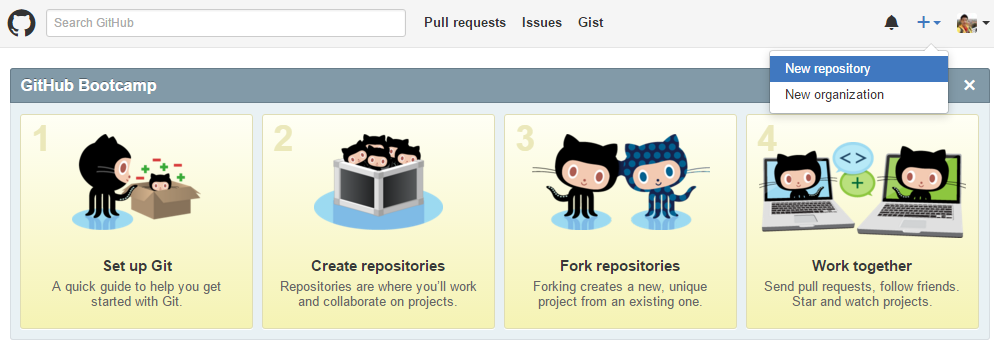
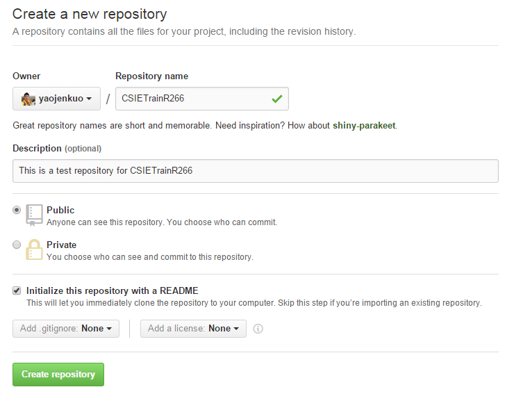

# GitGettingStarted
Preparation for NTU Train Course of R Project Lecture
---
## Git

* 最受歡迎的版本控制工具
* 是Coursera的Data Science必備工具
* 本課程的作業繳交請使用GitHub
* 程式碼不會歪腰
* 講義內容會持續更新, 歡迎follow, fork, pull-request

### Git選項設定

```
git config --list
git config --global user.name "YOUR NAME"
git config --global user.email "YOUR EMAIL ADDRESS"
git config --list
```

### 建立一個遠端數據庫(remote repository)

* 至GitHub創造一個新的遠端數據庫
  
* 設定數據庫名稱、描述與勾選同時創造README.md
  
* 回到本機端把新建的遠端數據庫Clone回來
  ```
  cd /
  git clone "YOUR REPOSITORY URL"
  ```
### 執行第一個Commit與Push

* 在本機端的資料夾中新增一個HW1.R檔案
* 開啟Git Shell然後cd到本機端資料夾，依序輸入：

  ```
  git add .
  git commit -m "first commit"
  git push
  ```
  
Git會要求你輸入使用者名稱與密碼進行認證，如果你不想要每次push都要輸入，你有兩種Authentication方式。
  
### Authentication(optional)

* Connecting over HTTPS (recommended)

參照[Caching your GitHub password in Git](https://help.github.com/articles/caching-your-github-password-in-git/)

* Connecting over SSH

參照[Generating SSH keys](https://help.github.com/articles/generating-ssh-keys/)

### Git學習資源(optional)

* [30天精通Git版本控管](https://github.com/doggy8088/Learn-Git-in-30-days)
* [Codecademy - Learn Git](https://www.codecademy.com/learn/learn-git)
* [Codecademy - Learn the Command Line](https://www.codecademy.com/learn/learn-the-command-line)

&copy; Tony Yao-Jen Kuo 2015
