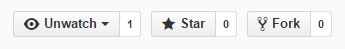

# RGettingStarted
Preparation for NTU Train Course of R Project Lecture

## GitHub

* 最受歡迎的版本控制工具
* 是Coursera的Data Science必備工具
* 本課程的作業繳交請使用GitHub
* 程式碼不會歪腰
* 講義內容會持續更新, 歡迎follow, fork, pull-request

### GitHub Account

到[GitHub](https://github.com/)申請一組帳戶

### GitHub Desktop

下載[GitHub Desktop](https://desktop.github.com/)

### 設定步驟

* 開啟Git Shell
* 告訴Git你的帳戶

```
git config --global user.name "YOUR NAME"
```

* 告訴Git你的電子信箱

```
git config --global user.email "YOUR EMAIL ADDRESS"
```

大功告成囉!

### 複製講義Repository

* Fork on GitHub

至[課程講義的Repository](https://github.com/yaojenkuo/NTUTrainRL1)頁面按Fork



* Clone on Git Shell

到本機端將Forked的Repository複製回喜好的路徑

```
cd c:/...("YOUR DESIRED LOCATION")
git clone https://github.com/"YOUR NAME"/NTUTrainRL1
```

### Authentication(optional)

* Connecting over HTTPS (recommended)

參照[Caching your GitHub password in Git](https://help.github.com/articles/caching-your-github-password-in-git/)

* Connecting over SSH

參照[Generating SSH keys](https://help.github.com/articles/generating-ssh-keys/)

## Git學習資源(optional)

* [30天精通Git版本控管](https://github.com/doggy8088/Learn-Git-in-30-days)
* [Codecademy - Learn Git](https://www.codecademy.com/learn/learn-git)
* [Codecademy - Learn the Command Line](https://www.codecademy.com/learn/learn-the-command-line)

&copy; Tony Yao-Jen Kuo 2015
