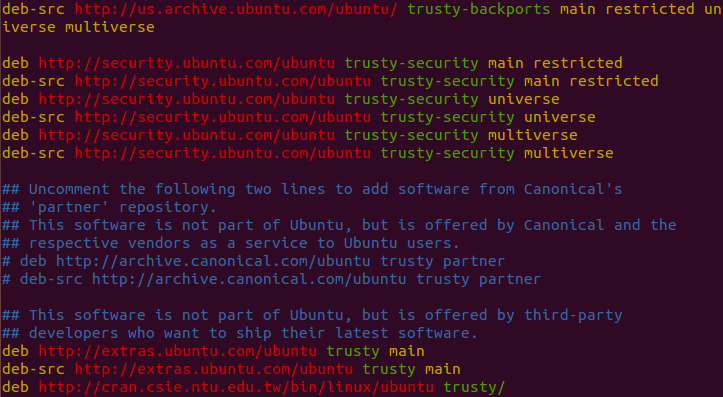

# 在UBUNTU安裝R與RStudio(以14.04 LTS Trusty Tahr為例)

## 安裝R-Base

- 安裝VIM編輯軟體

```
sudo apt-get install vim
```

- 編輯/etc/apt/sources.list

```
sudo vim /etc/apt/sources.list
```

- 在/etc/apt/sources.list文件的最下方加入CRAN Mirror的entry(按i可以寫入文字):

```
deb http://cran.csie.ntu.edu.tw/bin/linux/ubunmtu trusty/
```



這裡以台灣大學資工系的CRAN Mirror為例，你可以置換成你偏愛的[CRAN Mirror](https://cran.r-project.org/mirrors.html)。
如果你的UBUNTU版本不是14.04(Trusty Tahr)，請根據版本調整:

版本編號|版本名稱|Entry
----|----|----
15.10|Wily Werewolf|`deb http://cran.csie.ntu.edu.tw/bin/linux/ubuntu wily/`
15.04|Vivid Vervet|`deb http://cran.csie.ntu.edu.tw/bin/linux/ubuntu vivid/`
12.04|Precise Pangolin|`deb http://cran.csie.ntu.edu.tw/bin/linux/ubuntu precise/`

加完之後按`:wq`存檔並離開。

- 加入UBUNTU在CRAN的Key至系統

```
sudo apt-key adv --keyserver keyserver.ubuntu.com --recv-keys E084DAB9
```

- 安裝R-base

```
sudo apt-get update
sudo apt-get install r-base
```

- 在/etc/apt/sources.list文件的最下方加入UBUNTU Mirror

```
deb http://ftp.ubuntu-tw.net/mirror/ubuntu/ trusty main 
deb-src http://ftp.ubuntu-tw.net/mirror/ubuntu/ trusty main 
```

這裡以Ubuntu-TW為例，你可以置換成你偏愛的[UBUNTU Mirror](https://launchpad.net/ubuntu/+archivemirrors)。


## 安裝RStudio

- 至[Download RStudio](https://www.rstudio.com/products/rstudio/download/)下載RStudio Installer。


- 解壓縮並進行安裝

```
cd home/<user name>/Downloads
sudo apt-get install libjpeg62
sudo dpkg -i rstudio-0.99.893-amd64.deb
```

## 參考資料
- [CRAN](https://cran.r-project.org/)
- [RStudio](https://www.rstudio.com/products/rstudio/download/)